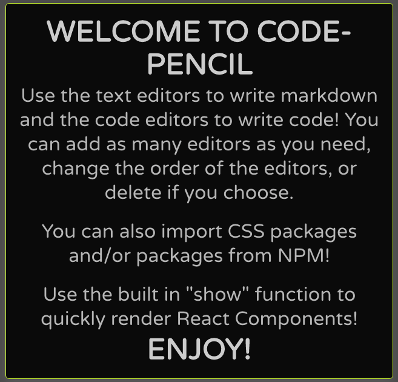

# code-pencil

### A CLI with a local API built with React and TypeScript that launches an interactive, dynamic development environment.

- Constructed ability to append multiple editors for markdown and code with built in “show” function to easily render React components and ability to communicate between code editors.

- Engineered capacity to integrate npm and css modules into browser based code editors.

- Established caching for previously imported modules to optimize performance and configured a local API for data persistence to a file in a directory.

- Employed esbuild with custom plugins to bundle, transpiling, and execute code in the browser.

## Installation

### Install: npm i code-pencil

### Run: npx code-pencil serve

